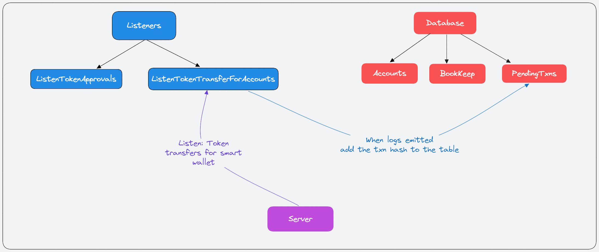
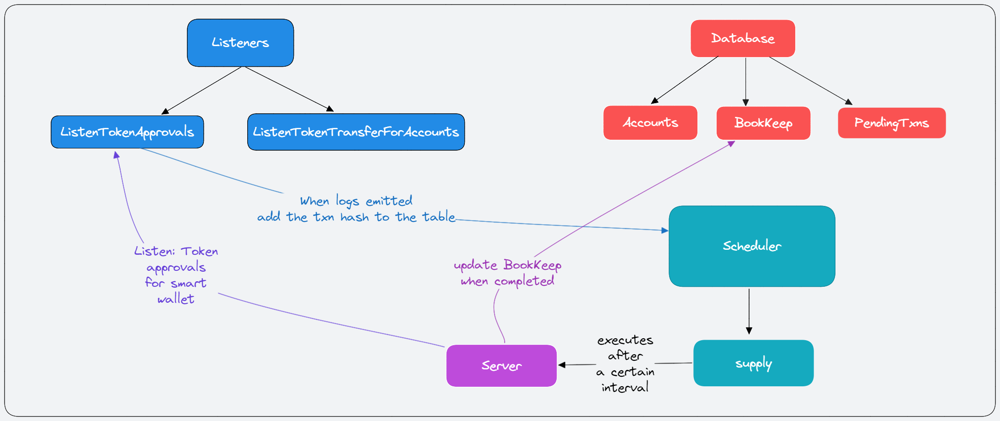

# GHO Bank

GHO Bank is a decentralized application which stakes your assets on your behalf on Aave V3 Market.
The purpose of the project is to automate the whole staking process and availing staking rewards. Also with GHO tokens as decentralized governed stable coin, borrowing them and using them as the primary token for all the transactions as well as for paying of gas fees.

Following are the important components for the project:

1. **Server**: listens and executes the supply & supplyWithPermit functions in [Bank Contract](https://github.com/keshavsharma25/gho-bank)
2. **Client**: a decentralized application that helps you stake, withdraw, borrow GHO and earn stake rewards.
3. **Contract**: Bank contract which helps the server interact with AAVE V3 Market on the behalf of the user.

## How Listening works?

The whole listening event works on the prerequisites of viem watchContractEvents.

### Listen Token Transfers

The above illustration depicts the addition of new transaction approvals that are to be signed by the user where the assets `threshold` is fetch during the onboarding.

### Listen Token Approvals

The above illustration depicts the execution of supply function when the approval is given after a certain delay set by the user during the onboarding.

## How to utilize GHO tokens?

The tokens automatically staked on the behalf of the user can be leveraged by the user to borrow GHO casually and use it for all kind of transactions and as well as a paymaster i.e. using GHO for paying gas fees.

---

## Related Repositories And Contract Address

Contracts: https://github.com/keshavsharma25/gho-bank
Server: https://github.com/keshavsharma25/gho-bank-server

Bank Contract Address: [0x6851b17D206Fb6820780F797343AFfC3a1f0b556](https://sepolia.etherscan.io/address/0x6851b17D206Fb6820780F797343AFfC3a1f0b556)

## Things that are still pending

Due to time constraints, we were not able to complete the following:

1. Decentralized App Frontend
   - Dashboard
   - GHO Permits
   - Send Assets
   - Smart Wallet Integration
2. Database integration in frontend

We hope to complete this project even after the hackathon and improve the UX of defi apps.
